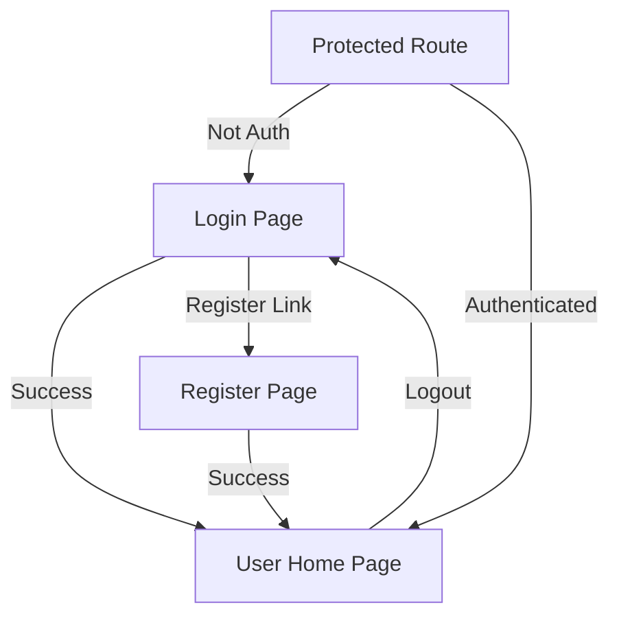

## 1. Product Overview
This is a web application built with React and better-auth authentication system. The application provides secure user authentication with username/password login, registration functionality, and user profile management.

The main purpose is to create a modern, secure authentication frontend that integrates seamlessly with the existing better-auth backend service, providing users with a smooth login and registration experience.

## 2. Core Features

### 2.1 User Roles
| Role | Registration Method | Core Permissions |
|------|---------------------|------------------|
| Normal User | Username/password registration | Can login, view profile, logout |
| Guest | No registration required | Can access login/register pages only |

### 2.2 Feature Module
Our authentication web application consists of the following main pages:
1. **Login page**: Username/password login form, link to registration.
2. **Register page**: User registration form with username and password fields.
3. **User Home page**: Displays user information and provides logout functionality.
4. **Protected Route**: Middleware to protect authenticated routes.

### 2.3 Page Details
| Page Name | Module Name | Feature description |
|-----------|-------------|---------------------|
| Login page | Login form | Username input field, password input field, submit button, link to register page, error message display. |
| Login page | Form validation | Real-time validation for username and password fields, minimum length requirements. |
| Register page | Registration form | Username input field, password input field, confirm password field, submit button, link to login page. |
| Register page | Form validation | Username uniqueness check, password strength validation, password confirmation match. |
| User Home page | User info display | Show current username, user ID, registration date, logout button. |
| User Home page | Navigation | Simple navigation with logout option. |
| Protected Route | Authentication check | Redirect to login if not authenticated, allow access if authenticated. |

## 3. Core Process

### User Authentication Flow
1. User visits the application and is redirected to login page if not authenticated
2. User can either login with existing credentials or navigate to registration
3. After successful login/registration, user is redirected to the user home page
4. User can view their profile information and logout from the home page
5. Protected routes ensure only authenticated users can access the home page

## 4. User Interface Design

### 4.1 Design Style
- **Primary Color**: #3b82f6 (Blue-500)
- **Secondary Color**: #1f2937 (Gray-800)
- **Button Style**: Rounded corners with hover effects
- **Font**: Inter font family with system fallbacks
- **Layout Style**: Centered card-based layout with responsive design
- **Icon Style**: Lucide React icons for consistency

### 4.2 Page Design Overview
| Page Name | Module Name | UI Elements |
|-----------|-------------|-------------|
| Login page | Login form | Centered card with white background, blue accent colors, input fields with icons, primary blue submit button, subtle animations on interaction. |
| Register page | Registration form | Similar to login but with additional confirm password field, clear visual hierarchy, password strength indicator. |
| User Home page | User info display | Clean header with user greeting, card-based info sections, prominent logout button in top navigation. |

### 4.3 Responsiveness
- Mobile-first responsive design
- Touch-friendly interface with appropriate tap targets
- Responsive grid system that adapts from mobile to desktop
- Smooth transitions and animations for better user experience