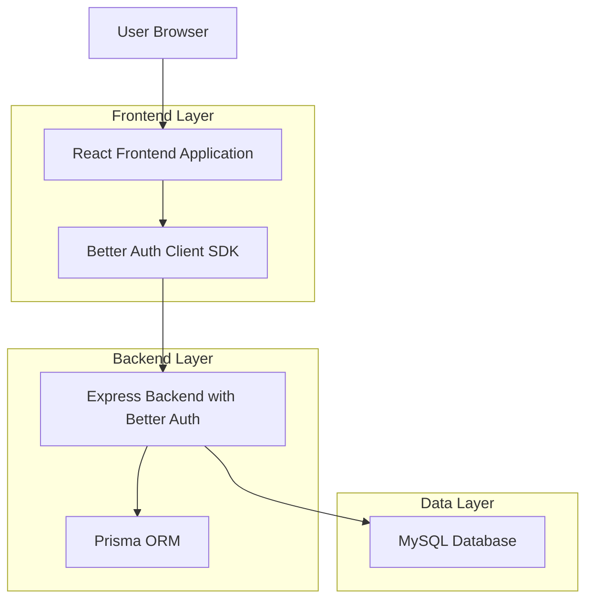
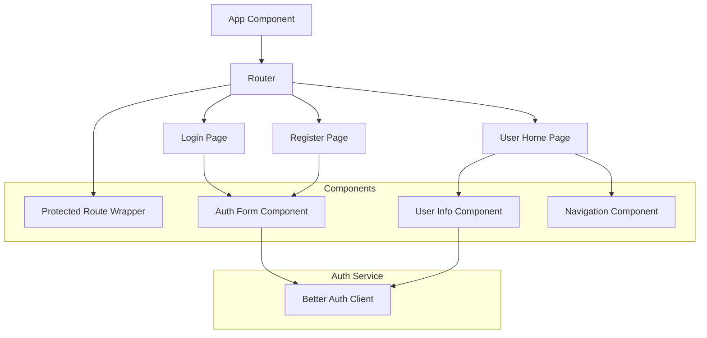
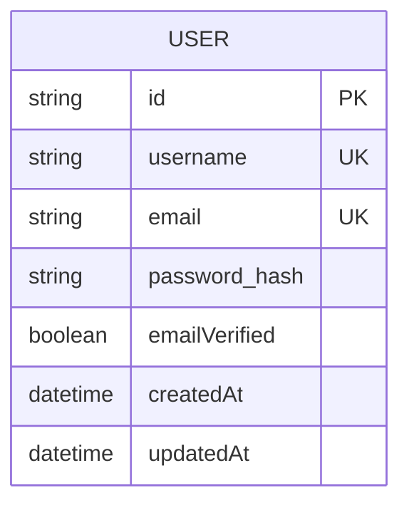

## 1. Architecture design



## 2. Technology Description

- **Frontend**: React@18 + TypeScript + Vite + TailwindCSS
- **Initialization Tool**: vite-init
- **UI Components**: shadcn/ui + Radix UI
- **Routing**: React Router DOM
- **HTTP Client**: Axios
- **Authentication**: Better Auth Client SDK
- **Backend**: Express.js with Better Auth
- **Database**: MySQL (via Prisma)

## 3. Route definitions

| Route | Purpose |
|-------|---------|
| / | Login page, main entry point for unauthenticated users |
| /login | Login page with username/password form |
| /register | User registration page |
| /home | User home page, displays user profile information |
| /protected | Example protected route requiring authentication |

## 4. API definitions

### 4.1 Authentication APIs (via Better Auth)

**User Login**
```
POST /api/auth/sign-in/username-password
```

Request:
| Param Name| Param Type  | isRequired  | Description |
|-----------|-------------|-------------|-------------|
| username  | string      | true        | The username of user |
| password  | string      | true        | User password |

Response:
| Param Name| Param Type  | Description |
|-----------|-------------|-------------|
| token     | string      | JWT authentication token |
| user      | object      | User data object |

**User Registration**
```
POST /api/auth/sign-up
```

Request:
| Param Name| Param Type  | isRequired  | Description |
|-----------|-------------|-------------|-------------|
| username  | string      | true        | The desired username |
| password  | string      | true        | User password |

**Get Session**
```
GET /api/auth/session
```

Response:
| Param Name| Param Type  | Description |
|-----------|-------------|-------------|
| session   | object      | Current user session data |
| user      | object      | Current user information |

## 5. Frontend architecture



## 6. Data model

### 6.1 User model (via Better Auth)


### 6.2 Better Auth Database Schema
Better Auth automatically manages the following tables:
- **users**: Core user information
- **sessions**: User session data
- **accounts**: Account linking for OAuth
- **verifications**: Email verification tokens

## 7. Security Considerations

- **HTTPS**: All communications should be encrypted
- **JWT Tokens**: Secure token storage and management
- **CSRF Protection**: Implemented via Better Auth
- **Rate Limiting**: Applied to authentication endpoints
- **Password Hashing**: bcrypt with salt rounds
- **Session Management**: Secure session handling with automatic expiration

## 8. Development Setup

1. **Frontend Development**
   ```bash
   cd /Users/wepie/WorkSpace/Self/prefer-node/apps/server-express-better-auth/web
   npm install
   npm run dev
   ```

2. **Environment Variables**
   ```env
   VITE_API_URL=http://localhost:3000
   VITE_AUTH_COOKIE_NAME=better-auth-session
   ```

3. **Build Process**
   ```bash
   npm run build
  